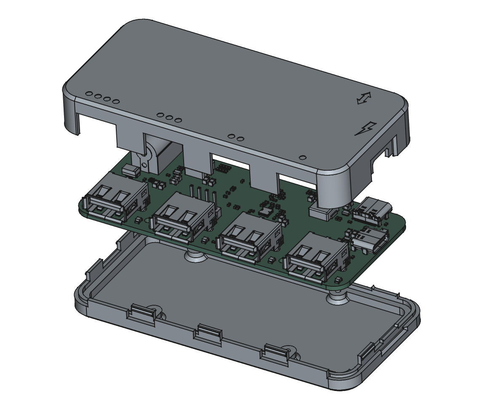

3D printed case for the Kalid
===

Compatibility
---

Tested with EVT5.

Printing
---

Print one of each:

 - case-Top.step
 - case-Bottom.step

Set your printer to 0.2mm layers. Each part can print on its flat side without any supports.

Tested with PLA but should also work with PETG and other common filaments.

Assembly
---

Use 2x M2x4mm screws to fasten the PCB to the bottom of the case. There are 4 mounting holes and posts, you could use all 4 but only 2 have enough clearance (one barely) to fit a screw head. The mounting posts are not tapped, but an M2 screw will tap it easily.

The top part of the case snaps on.

To take apart the case, separate it first at the corner where the data USB port is. The pocket for the USB cable overmolding makes it easy to use your fingers there.

Future Work
---

The case would benefit from a few improvements:

1. Holes and 3D printed light pipes for LED indicators.
2. The parting line around the USB-C sockets should go further up into the top part of the case.
3. Ribbing in the top part to reduce flexing when handling the case.

Licensing
---

Copyright 2026 Sergiusz Bazanski

The files here are licensed under CERN-OHL-P, see COPYING.txt.
